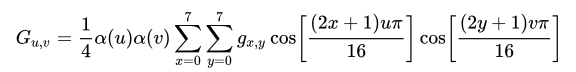
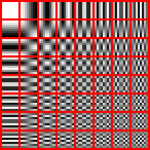

# Steganography
Steganography is the practice of concealing information within seemingly innocent data, such as images. The goal of steganography is to hide the existence of the hidden information rather than to protect the content's confidentiality. It is a form of security through obscurity.
## Description
This is a simple staganographic tool that can be used to hide contents of an arbitrary file in an image. The image is slightly modified, but not enough to be noticeable by the human eye. Along with the actual file data, also a header contatining metadata is embedded, so that the content can later be extracted from the image and is saved with its original file name. The contents of the file are hidden in the image by one of the two following methods:

---

### JSteg algorithm:
This method is a variant of the following LSB method, except the least significant bits are hidden in the discrete cosine transform (DCT) coefficients of the image. We perform the JPEG compression and embed the hidden data in the middle of it. 
- Convert to frequency domain: The image is loaded as a bitmap and the DCT is computed for every 8x8 block of pixels for every channel Y, Cb and Cr using the following formaula:   
This converts the block to the frequency domain and the DCT coefficients can be understood as the coefficcients of the linear combination of cosine functions that approximate the block of pixels.  
<div align="center">
  
</div>
<!--  -->

- Quantization (lossy step): The DCT coefficients are then quantized using a quantization table (elementwise division of 8x8 matrices). Many of the high-frequency coefficients will be zero, which means they can be efficiently compressed by huffman coding. The quantization table is chosen to be the same as the one used in the JPEG standard and can be scaled to achieve different compression ratios.
- **Steganographic step:** Hide the file data in the non-zero-or-one AC coefficients.
- Huffman coding (compression step): Use huffman coding to compress the block of image data in zig-zag order as per the JPEG standard.  
<div align="center">
    
</div>  

- The image is saved in jpg format and can be opened by any image viewer.  

With the dafault quality setting Q=50 it takes around 14 bytes of jpeg data to hide 1 byte of file data. The quality can be changed by the user. With lower qualities there may be some noticeable artifacts in the image.
### Least significant bit (LSB) method: 
The contents of the file are hidden in the least significant bit of each pixel in the image in the spatial domain. The input image is loaded as a bitmap and a specified number of the least-significant bits (1-8) are replaced with the contents of the file. The number of bits used to hide the file is specified by the user. This method is very simple, fast and has a relatively large capacity. The higher the number of bits used, the more noticeable the changes are. Default number of bits used is 1. The image is saved in png format.

---

## Usage
The program can be run using `dotnet run` which compiles the code and runs it, or by `dotnet build`, changing into the directory with the binary and running `./Steganography <command> <args>`.  
Descriptions of available commands and their arguments are listed below.
### Hide
The hide command performs the embedding of a message into an image. It takes a method, input file to be hidden, cover image and, optionally, an output image path or a qualiy setting in case of `jsteg` or bits per byte in case of `lsb` method. Note, that the order of optional parameters does not matter and is inferred by the program. If no output image path is specified, the steganographic image is saved in current directory with its original name prepended by "steg_".  
**Semantics**:
```
hide <method> <input_file> <cover_image> [<output_image>] [<quality/bits_per_byte>]
```
**Examples**:

Hide a simple text file in an image using the jsteg method with default quality setting and save it in the examples directory:
```
dotnet run hide jsteg examples/secret.txt examples/nature.jpg examples/jsteg_nature.jpg
```

Hide a simple text file in an image using the lsb method with 2 bit per byte:
```
dotnet run hide lsb examples/secret.txt examples/nature.jpg examples/lsb_steg_nature.png 2
```

### Extract
The extract command performs the extraction of a message from an image. It takes a method and a steganographic image. The extracted file is saved with its original name in the current directory prepended with "extr_".  
**Semantics**:
```
extract <method> <steg_image>
```
**Examples**:

Extract a hidden file from an image of a forest using the jsteg method: (the extracted file is a text file containing a message)
```
dotnet run extract jsteg examples/forest.jpg
```

Extract a file from an image of flowers using the lsb method: (the extracted file is a jpg image of the earth)
```
dotnet run extract lsb examples/flowers.png
```

### Capacity
Prints the capacities (maximum size of a hidden file) that can be hidden in the image using the specified method and various quality settings (for jsteg) or bits per byte (for lsb). The capacities are printed in bytes and kilobytes.  
**Semantics**:
```
capacity <method> <image>
```
**Examples**:
```
dotnet run capacity jsteg examples/flowers.png
```
```
dotnet run capacity lsb examples/forest.jpg
```

### Compress
Compress the provided image using jpeg compression with provided quality setting (0 < Q <= 100) and and save it.  
**Semantics**:
```
compress <input_image> <output_image> <quality>
```
**Examples**:

Compressing the same image with different quality settings 50 and 5:
```
dotnet run compress examples/flowers.png examples/compressed_flowers_50.jpg 50
```
```
dotnet run compress examples/flowers.png examples/compressed_flowers_5.jpg 5
```

